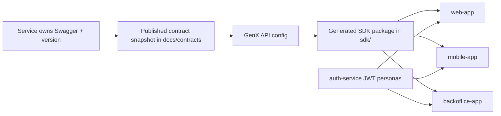

# GenX API Ecosystem Demo

End-to-end proof of the GenX API open source ecosystem inside an Nx monorepo.

It shows the full handoff from service-owned contract publication to GenX API SDK generation to multi-consumer adoption:

- backend services own Swagger and contract publication
- [GenX API](https://github.com/genxapi/genxapi) starts from those published contracts
- generated SDK packages remain independent demo deliverables
- consumer apps adopt the SDKs through normal package boundaries

The demo now includes three services, three consumers, and role-aware JWT personas:

- `web-app`: customer self-service in the browser
- `mobile-app`: customer self-service in Expo / React Native
- `backoffice-app`: internal operations for support and admin users

## Open Source Ecosystem

| Repository | Role in the ecosystem | Use it when |
| --- | --- | --- |
| [`genxapi`](https://github.com/genxapi/genxapi) | Core generator product and CLI for contract-driven SDK package generation | You want to generate SDKs locally, in custom CI, or through your own workflow orchestration |
| [`genxapi-action`](https://github.com/genxapi/genxapi-action) | Official GitHub Actions adoption path for GenX API | Your team wants the GitHub-native wrapper around the GenX API CLI |
| [`genxapi-ecosystem-demo`](https://github.com/genxapi/genxapi-ecosystem-demo) | End-to-end proof of contract publication, SDK generation, and multi-consumer adoption | You want to understand the full ecosystem story or run a conference-ready technical demo |

This repository is the proof repo. It intentionally shows the lifecycle that the core product and the GitHub Action support elsewhere, without putting demo packages in the core `@genxapi/*` namespace.

## What This Repository Demonstrates

- `auth-service`, `users-service`, and `payments-service` own their contracts and publish versioned snapshots under `docs/contracts/`
- GenX API reads those published snapshots through `genxapi.users.config.json` and `genxapi.config.json`
- `sdk/users-sdk` and `sdk/payments-sdk` are generated packages, not handwritten app clients
- the customer apps and the backoffice app all adopt those SDKs explicitly
- demo-local packages use the separate `@genxapi-labs/*` scope so they do not pollute the core `@genxapi/*` package surface
- JWT claims decide which app flows are valid for each persona

## Ecosystem Flow



1. A backend team ships a service and publishes a contract snapshot.
2. GenX API consumes that published snapshot, not the live service.
3. GenX API generates SDK packages from the published contract.
4. Consumer apps adopt those SDK packages and inject runtime base URLs plus bearer tokens at the app boundary.

## Repository Tour

| Path | Role in the demo |
| --- | --- |
| `apps/auth-service` | Issues JWTs for seeded customer, support, and admin personas |
| `apps/users-service` | Owns the users contract and user-facing plus internal user routes |
| `apps/payments-service` | Owns the payments contract and customer plus internal payment routes |
| `docs/contracts/*` | Published service-owned contract snapshots used as GenX API inputs |
| `genxapi.users.config.json` | GenX API config for the users SDK, pointed at the published users contract |
| `genxapi.config.json` | GenX API config for the payments SDK, pointed at the published payments contract |
| `sdk/users-sdk` | Generated users SDK package consumed by apps |
| `sdk/payments-sdk` | Generated payments SDK package consumed by apps |
| `libs/auth-client` | Shared auth-service session helpers and types |
| `apps/web-app` | Customer self-service browser app using `/me` and `/me/payments` |
| `apps/mobile-app` | Second customer consumer using the same role-aware customer scope in Expo |
| `apps/backoffice-app` | Internal support/admin app using `/users`, `/users/:id`, and admin-only `/payments` |

## Consumer Apps

| App | Audience | Main routes or views | What it proves |
| --- | --- | --- | --- |
| `web-app` | Customer | `/profile`, `/payments` | Customer self-service can adopt generated SDKs without exposing internal routes |
| `mobile-app` | Customer | `My Profile`, `My Payments` tabs | A second customer consumer can reuse the same contracts and SDK boundary in a different runtime |
| `backoffice-app` | Support and admin | `/users`, `/users/:userId`, admin-only `/payments` | Internal operations can adopt the same published-contract workflow while keeping role-aware routing |

## JWT Personas

`auth-service` seeds four demo accounts and returns JWTs with the role claims the apps use for routing and SDK calls.

| Persona | Role | Credentials | Use it in | What to show |
| --- | --- | --- | --- | --- |
| Bob Smith | `customer` | `bob.smith@example.com` / `bob-demo-password` | `web-app`, `mobile-app` | Profile plus two payment records, including a refund |
| Ethan Williams | `customer` | `ethan.williams@example.com` / `ethan-demo-password` | `web-app`, `mobile-app` | Simpler customer path with one completed payment |
| Diana Miller | `support` | `diana.miller@example.com` / `diana-demo-password` | `backoffice-app` | Users list, user detail, and user-scoped payment investigation |
| Alice Johnson | `admin` | `alice.johnson@example.com` / `alice-demo-password` | `backoffice-app` | Full internal workflow, including the global payments queue |

Role expectations:

- `customer` claims are valid in `web-app` and `mobile-app`
- `support` and `admin` claims are valid in `backoffice-app`
- customer claims are rejected from internal backoffice routes
- support can inspect a specific user's payments, but only admin can browse the global payments queue

## Quick Start

Install dependencies, publish the current contracts, build the generated SDKs, then run the browser demo:

```bash
npm install
npm run demo:prepare
npm run demo:serve
```

Open:

| Surface | URL |
| --- | --- |
| Web app | `http://localhost:4200` |
| Backoffice app | `http://localhost:4300` |
| Auth Swagger UI | `http://localhost:3003/swagger` |
| Users Swagger UI | `http://localhost:3001/swagger` |
| Payments Swagger UI | `http://localhost:3002/swagger` |

What `demo:prepare` does:

- publishes the current service contracts through each service-owned `publish-contract` target
- rebuilds both SDK packages from those published contracts

That preserves the real story instead of hiding contract publication and SDK generation inside app startup.

## Optional Mobile Demo

The mobile app is intentionally separate from `demo:serve` because Expo needs explicit runtime URLs instead of the Vite proxy setup used by the browser apps.

Start the services first with `npm run demo:serve`, then configure and run Expo:

```bash
cp apps/mobile-app/.env.example apps/mobile-app/.env
npm run demo:serve:mobile
```

Default local values in `apps/mobile-app/.env.example` point at:

- `http://127.0.0.1:3003` for `auth-service`
- `http://127.0.0.1:3001` for `users-service`
- `http://127.0.0.1:3002` for `payments-service`

If you are testing on a physical device, replace `127.0.0.1` with your machine's LAN IP.

## Root Scripts

| Command | Purpose |
| --- | --- |
| `npm run demo:contracts` | Publish all service-owned contracts into `docs/contracts/` |
| `npm run demo:sdks` | Rebuild both SDK packages from the published contracts |
| `npm run demo:prepare` | Run contract publication and SDK rebuild in the recommended order |
| `npm run demo:serve` | Start `auth-service`, `users-service`, `payments-service`, `web-app`, and `backoffice-app` |
| `npm run demo:serve:mobile` | Start the Expo mobile app |
| `npm run build:browser-apps` | Verify `web-app` and `backoffice-app` compile against the built SDK packages |
| `npm run graph` | Inspect the Nx dependency graph |

## Recommended Live Demo Flow

1. Start with the backend ownership story.
   Show the Swagger UIs for `auth-service`, `users-service`, and `payments-service`, then point to `docs/contracts/<service>/latest.json` as the published contract snapshot.
2. Show the GenX API handoff.
   Open `genxapi.users.config.json` and `genxapi.config.json`, then point to `sdk/users-sdk` and `sdk/payments-sdk` as the generated downstream packages.
   If you want the GitHub-native adoption path after the local demo, point to [`genxapi-action`](https://github.com/genxapi/genxapi-action).
3. Show customer self-service in `web-app`.
   Use Bob Smith first because his account shows both normal payment history and a refund. Switch to Ethan Williams if you want a simpler customer example.
4. Show internal operations in `backoffice-app`.
   Sign in as Diana Miller to show support access to `/users` and user-scoped payment history, then show that `/payments` is blocked. Switch to Alice Johnson to unlock the full payments queue.
5. Optionally show `mobile-app` as the second customer consumer.
   Use Bob or Ethan again to prove that the same published-contract and generated-SDK story works in a React Native shell as well.

That sequence keeps the lifecycle obvious:

service publishes contract -> GenX API generates SDK -> multiple apps adopt the SDK

## What Each App Should Show

| App | Persona | Expected result |
| --- | --- | --- |
| `web-app` | Bob or Ethan | Customer session picker, then `My Profile` and `My Payments` powered by `/me` routes |
| `web-app` | Support or admin token | Prompt to switch back to a customer persona |
| `mobile-app` | Bob or Ethan | Same customer-only profile and payment flows in Expo |
| `mobile-app` | Missing env | Persona buttons stay disabled until all `EXPO_PUBLIC_*` URLs are configured |
| `backoffice-app` | Diana | Users directory, user detail, and user-level payments only |
| `backoffice-app` | Alice | Same internal routes plus the admin-only global payments queue |
| `backoffice-app` | Customer token | Prompt to switch to a support or admin persona |

## Architecture Notes

- `publish-contract` belongs to the backend service lifecycle, not to GenX API generation and not to consumer startup
- `latest.json` is a local-development convenience alias; reproducible automation should pin `docs/contracts/<service>/<version>.json`
- backend service version and OpenAPI contract version stay aligned
- SDK package versioning remains an independent downstream concern
- apps own session storage, runtime base URLs, and bearer-token injection
- this repository uses `docs/contracts/` as a local contract registry for the demo

## Honest Scope Notes

- The contract registry in this repo is local and file-based for demo clarity.
- The mobile app is optional in the default demo flow because Expo needs separate runtime configuration.
- There is still no release automation layer such as Nx Release or semantic-release in this repository.

## Supporting Docs

- [docs/current-stage.md](docs/current-stage.md)
- [docs/contract-versioning.md](docs/contract-versioning.md)
